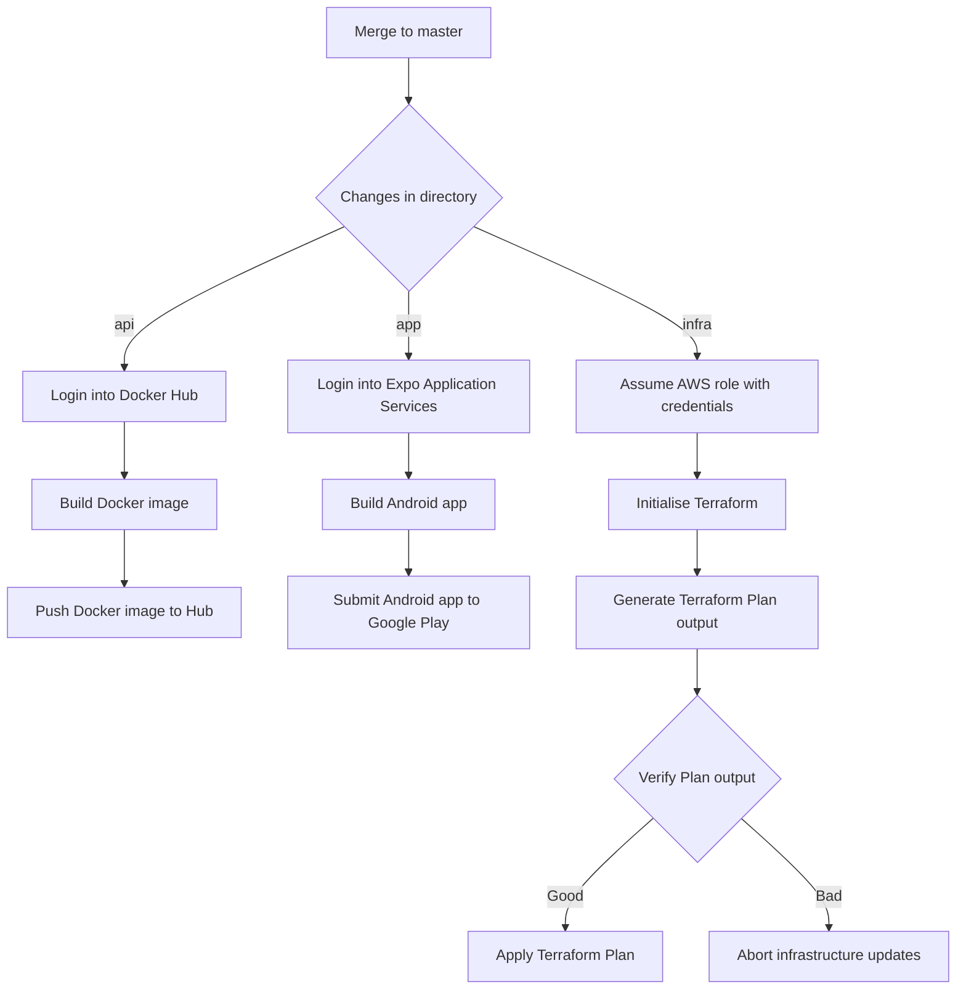

```mermaid
graph TD;
    start[Merge to master]-->changes{Changes in directory}
    
    changes-->|api|loginDocker[Login into Docker Hub]
        -->buildDocker[Build Docker image]
        -->pushDocker[Push Docker image to Hub]
    
    changes-->|app|loginExpo[Login into Expo Application Services]
        -->buildAndroid[Build Android app]
        -->submitAndroid[Submit Android app to Google Play]

    changes-->|infra|assumeRole[Assume AWS role with credentials]
        -->terraformInit[Initialise Terraform]
        -->terraformPlan[Generate Terraform Plan output]
        -->verifyChanges{Verify Plan output}
        -->|Good|applyPlan[Apply Terraform Plan]
        verifyChanges-->|Bad|abort[Abort infrastructure updates]
```