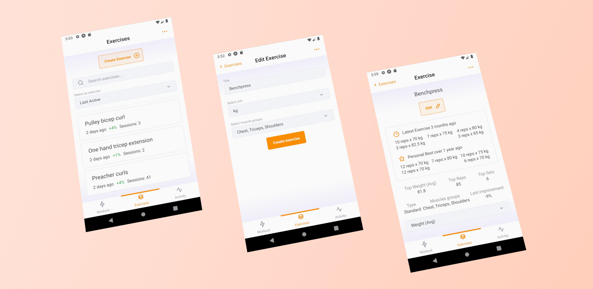

## What is Robic?

Robic is a mobile application for simple exercise tracking and analysis.

Robic helps athletes and enthusiasts track their workouts and provides analytics to follow their progress.

### Get started!
- Download for Android at the [Google Play Store](https://play.google.com/store/apps/details?id=com.app.robic) 
- View our [Privacy Policy](./docs/PrivacyPolicy.md)

Some of the features Robic provides are:

- Workout tool for tracking sets, reps, weight, and time to complete
- Exercise library for storing all of your exercises
- Exercise analytics, such as personal bests, average and net weight over time
- All-time analytics, such as most frequently used muscle groups and exercises

More features to come!

## Robic Stack

**Robic Client**

Built using React Native, Expo, TypeScript and UI Kitten.

**Robic API**

Built using .NET and MongoDB.

## Developing with Robic
Documentation specific to different aspects of Robic development can be found in their respective directories.
Of specific note are:
- [Developing the Robic App](./app/README.md)
- [Developing the Robic API](./api/README.md)
- [Developing the Robic infrastructure](./infra/README.md)

Developed and designed by Ryan Achten
