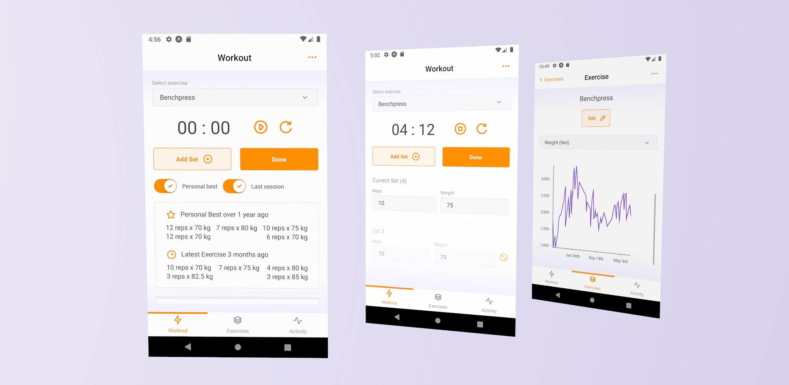

# Robic

## What is Robic?

Robic is a mobile application for simple exercise tracking and analysis.

Robic helps athletes and enthusiasts track their workouts and provides analytics to follow their progress.

Some of the features Robic provides are:

- Workout tool for tracking sets, reps, weight, and time to complete
- Exercise library for storing all of your exercises
- Exercise analytics, such as personal bests, average and net weight over time
- All-time analytics, such as most frequently used muscle groups and exercises

More features to come!

## Robic Stack

**Robic Client**

Built using React Native, Expo, TypeScript and UI Kitten.

**Robic Server**

Build usng .NET and MongoDB.

Repository for the Robic API - `RobicServer` can be found [here](https://github.com/ryanachten/RobicServer).

## Developing with Robic

**Running Robic**

- Install Node, Yarn and Expo CLI
- Run `yarn start` and select target platform (iOS and Android actively maintained)
- See instructions on the `RobicServer` repo for running against local environments

**Building Robic**

- Run Expo Build against target platform `expo build:android -t app-bundle`
- You can then test the latest build on a real mobile device using the Expo Go application

Developed and designed by Ryan Achten
