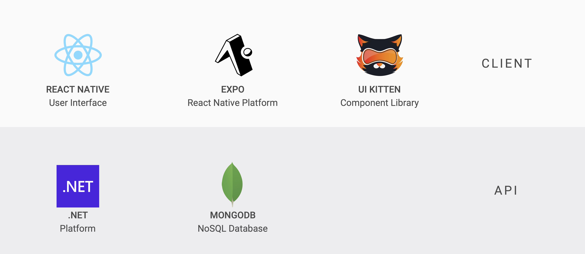
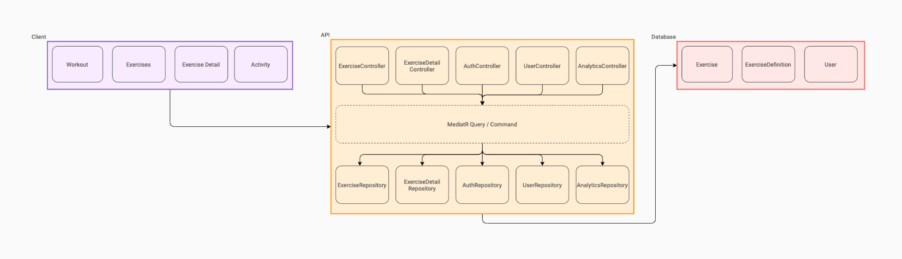
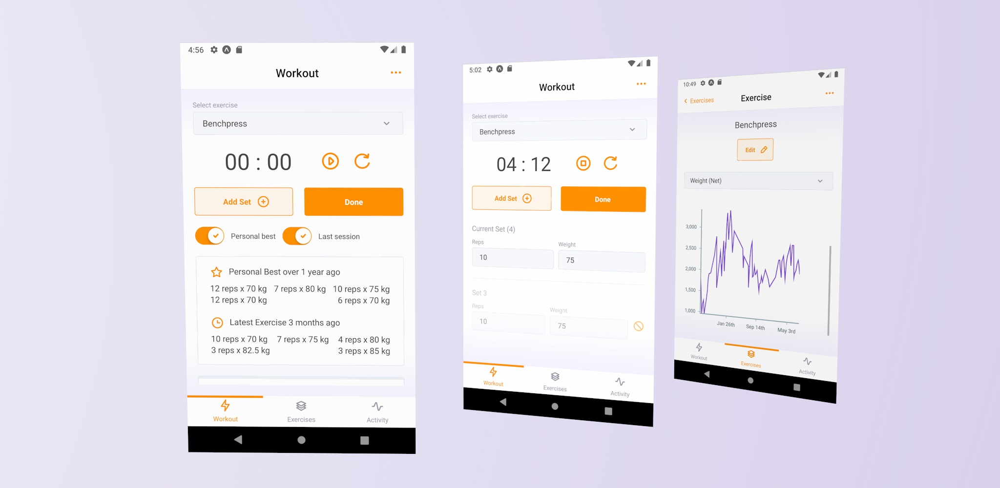
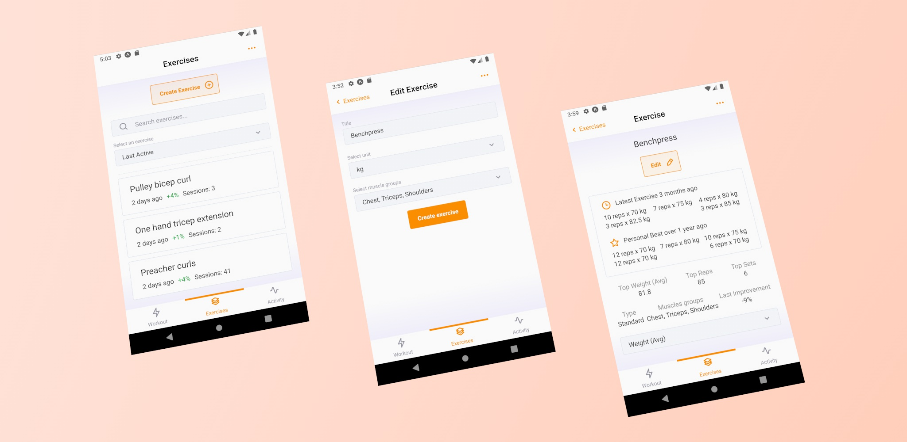
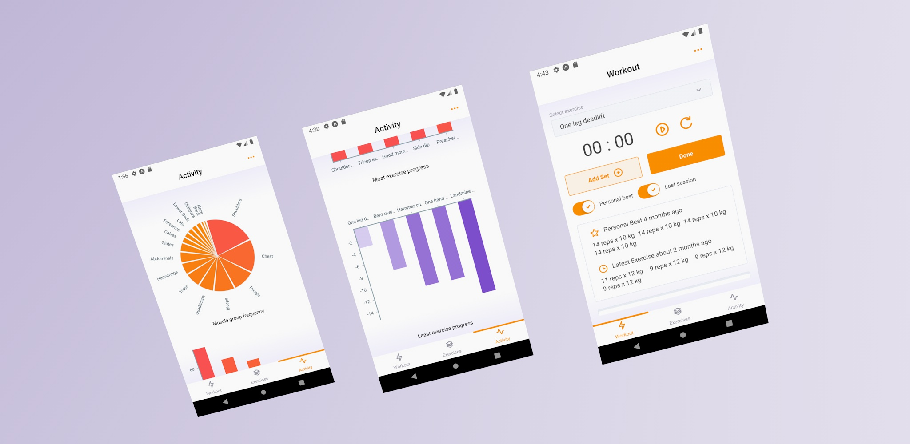

# RobicServer


## What is RobicServer?

RobicServer is the API for the [Robic mobile application](https://github.com/ryanachten/Robic).

Robic helps athletes and enthusiasts track their workouts and provides analytics to follow their progress.



## Robic Stack

**Robic Client**

Built using React Native, Expo, TypeScript and UI Kitten.

**Robic Server**

Build usng .NET and MongoDB.

Repository for the Robic API - `RobicServer` can be found [here](https://github.com/ryanachten/RobicServer).



## Robic Architecture

RobicServer is divided into three layers:

- The **controller layer** for receiving and responding to incoming requests
- The **service layer** comprised predominantly of Mediator queries and commands
- The **repository layer** which functions as a data access layer to the MongoDB database



## Developing with RobicServer

### Developing using environment variables

Robic uses a number of environment variables to prevent sensitive environment variables being exposed to a public codebase such as this. To setup your local environment for development, you will need to set the following environment variables:

- `TokenKey` - secret token used for password hashing
- `DatabaseName` - MongoDB database name
- `ConnectionString` - MongoDB database connection string

This can be prefixed prior to calling `dotnet watch run`.
i.e.

```
TokenKey="123abc" \
DatabaseName="robic_database" \
ConnectionString="mongodb://User:host.com:port/robic_database?retryWrites=false" \
dotnet run
```

For simplicity's sake, we keep this in `startup.sh` (omitted from Git)

**Note:** when deploying to a remote environment, these variables will need to be set (i.e. in our case we use Heroku, so we need to set them via https://devcenter.heroku.com/articles/config-vars#managing-config-vars )



## Developing locally with React Native

To run with iOS simulator, we need to run the server in HTTPS. However, iOS does not seem to work with `localhost` domains when running .NET Core locally. To work around this, we route the local server using [ngrok](https://ngrok.com/).

Steps:

- Run .NET Core while watching for changes: `dotnet watch run`
- Point ngrok at localhost: `ngrok http https://localhost:5001`
- Use forwarding address printed by ngrok as API URL for React Native local development



Developed and designed by Ryan Achten
