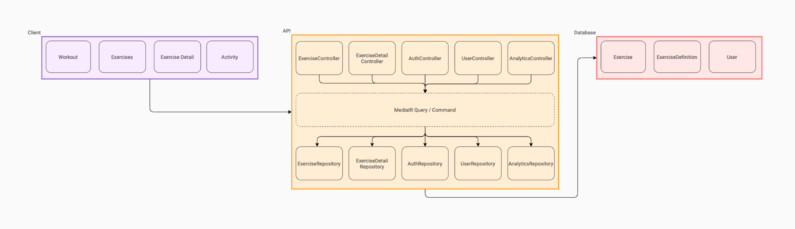

# API Development



## Robic Architecture

Robic's API is divided into three layers:

- The **controller layer** for receiving and responding to incoming requests
- The **service layer** comprised predominantly of Mediator queries and commands
- The **repository layer** which functions as a data access layer to the MySQL database

## Developing with Robic API

### Developing using environment variables

Robic uses a number of environment variables to prevent sensitive environment variables being exposed to a public codebase such as this. To setup your local environment for development, you will need to set the following environment variables:

- `TokenKey` - secret token used for password hashing
- `MySQLConnectionString` - MySQL database connection string

This can be prefixed prior to calling `dotnet watch run`.
i.e.

```
TokenKey="123abc" \
MySQLConnectionString="123abc" \
dotnet run
```

For simplicity's sake, we keep this in `startup.sh` (omitted from Git)

### Developing with Docker

```bash
# from api directory
cd /api

# build Docker image
docker build -t ryanachten/robic -f .\Dockerfile .

# run Docker container available on http://localhost:5000/
docker run -it --rm -e TokenKey="token key" -e MySQLConnectionString="MySQL connection string" -p 5000:80 ryanachten/robic

# push changes to Docker Hub if things are looking good (requires Docker Hub login)
docker login
docker push ryanachten/robic

```

### Developing locally with React Native

#### Android

To run with Android, we need to reference local ports using `http://10.0.2.2:PORT` - see [here](https://developer.android.com/studio/run/emulator-networking#networkaddresses) for more information.

#### iOS

To run with iOS simulator, we need to run the server in HTTPS. However, iOS does not seem to work with `localhost` domains when running .NET Core locally. To work around this, we route the local server using [ngrok](https://ngrok.com/).

Steps:

- Run .NET Core while watching for changes: `dotnet watch run`
- Point ngrok at localhost: `ngrok http https://localhost:5001`
- Use forwarding address printed by ngrok as API URL for React Native local development
